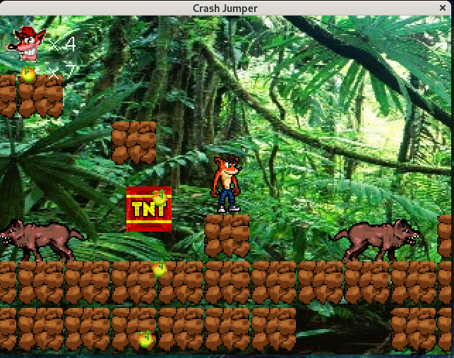

# Crash the Hopper

**„Crash the Hopper”** – nazwa gry. Jest to gra platformowa 2D.  

---


## Sterowanie

| Klawisz       | Akcja                     |
|---------------|---------------------------|
| Strzałki  ↓←↑→     | Poruszanie się            |
| W             | Skok                      |
| F             | Rzut jabłkiem             |
| P             | Pauza                     |


---

## Uruchamianie gry

Aby uruchomić grę, należy:

1. Pobrać plik `GameSkoczekCrash.jar`.
   (alternatywnie: https://drive.google.com/file/d/1whhJ-GzxuKT8rjPXEJRWX39kY8vsu9UJ/view?usp=drive_link) 
2. Upewnić się, że na komputerze zainstalowana jest **Java** (JDK lub JRE).  
3. Otworzyć terminal / wiersz poleceń w katalogu z plikiem `GameSkoczekCrash.jar`.  
4. Uruchomić grę komendą:

```bash
java -jar GameSkoczekCrash.jar
```

---

## Poziomy
W grze dostępne są **2 mapy**.
Jednak gra została zaprojektowana tak, aby **łatwo dodawać kolejne poziomy** w nieskończonej liczbie.
Aby przejść do kolejnego poziomu, należy znaleźć **skrzynkę z rysunkiem twarzy postaci gracza**. Podejście do niej przenosi do następnego stanu gry.

---

## Plansza
Mapa składa się z **klocków**, po których można się poruszać – są one stałym elementem mapy i normalnie nie można ich zniszczyć.  
Na planszy znajdują się również:  
- czerwone skrzynki z napisem **TNT**,  
- wściekłe psy,  
- jabłka.

---


## Screenshot

<p align="center">
  
</p>


---


## Wściekłe psy
- Mają **5 punktów życia**.  
- Kontakt z nimi oznacza utratę życia gracza (im dłuższy kontakt, tym więcej tracimy).  
- Należy je omijać lub pokonywać.  
- Gracz może rzucać jabłkami **bez limitu** – każde trafienie zabiera psu jeden punkt życia.  
- Gdy psy mają 0 punktów zdrowia lub spadną w przepaść → znikają.

---

## Skrzynki TNT
- Czerwone kwadraty, po których można chodzić, ale z małym haczykiem.  
- Po wejściu aktywuje się **licznik 3s**, po czym skrzynka znika na 1s → gracz spada → skrzynka wraca.  
- Poruszają się między przeszkodami i odbijają od siebie przy kolizji.  
- Utrzymują stałą wysokość.

---

## Jabłka
- Znajdują się na mapie i określają punktację.  
- **Każde podniesione jabłko = 1 punkt**.  
- Rzucone jabłko **nie wpływa na wynik** – służy tylko do zadawania obrażeń psom.

---

## Gracz
- Domyślnie ma **5 żyć**.  
- Traci je spadając w przepaść lub będąc ugryzionym.  
- Przytrzymanie klawisza `w` pozwala dłużej unosić się w powietrzu.

---

## Cel gry
Zdobycie jak największej liczby jabłek, które przeliczają się na punkty **1:1**.

---

## Serwer
- Dostęp do najlepszych wyników tylko poprzez połączenie z serwerem.  
- Serwer przesyła mapę dla każdego poziomu gry.

---

